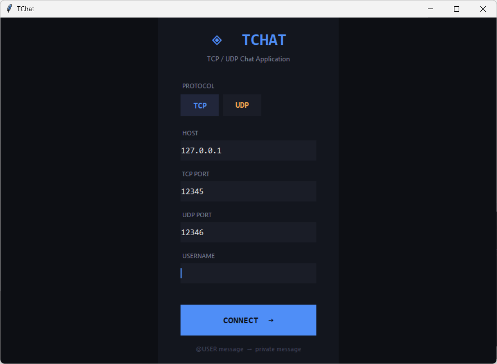
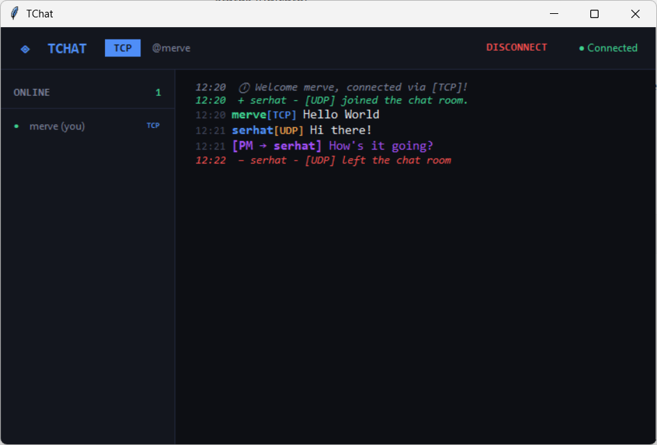

<div align="center">
  
# ◈ TChat

A real-time, terminal-style chat application supporting both TCP and UDP protocols.


</div>

---

<div align="center">
  
   
</div>

## Features

- Simultaneous TCP and UDP client support
- Public chat room visible to all connected users
- Private messaging — type `@username message`
- Live online user list with protocol badge (TCP / UDP)
- Duplicate username prevention
- Dark, modern UI

---

## Architecture

TChat uses a hybrid socket architecture:

- TCP clients communicate through persistent, reliable connections
- UDP clients communicate using lightweight datagrams
- The server manages both protocols simultaneously
- Each client runs a dedicated receive thread for real-time communication
- Shared resources are protected with thread locks to avoid race conditions

---

## UI Highlights

- Terminal-inspired dark theme
- Real-time connection status indicator
- Color-coded TCP / UDP messages
- Join / leave event highlighting
- Interactive online users sidebar
- One-click private messaging

---

## Getting Started

```bash
git clone https://github.com/user/tchat.git
cd tchat
```

No install step needed — zero external dependencies.

### 1. Start the server

```bash
python server/server.py
```

Listens on:
- TCP → `127.0.0.1:12345`
- UDP → `127.0.0.1:12346`

### 2. Start a client

```bash
python client/main.py
```

Pick a protocol, enter a username, hit **CONNECT**.

---

## Private Messages

Type in the message box:

```
@username hello there
```

Only the target user receives it. You can also click a username in the sidebar to auto-fill.

---

## Example Commands

| Action | Command |
|---|---|
| Public message | `hello everyone` |
| Private message | `@user hi there` |
| Disconnect | `DISCONNECT button` |

---

## Project Structure

```
tchat/
├── server/
│   └── server.py           # TCP + UDP hybrid server
├── client/
│   ├── main.py             # Entry point
│   ├── app.py              # Main app controller
│   ├── gui/
│   │   ├── chat_screen.py  # Chat UI
│   │   ├── login_screen.py # Login UI
│   │   ├── user_list.py    # Online users sidebar
│   │   └── theme.py        # Colors & fonts
│   ├── network/
│   │   ├── tcp_client.py   # TCP connection manager
│   │   └── udp_client.py   # UDP connection manager
│   └── utils/
│       └── message.py      # Message parser & formatter
└── requirements.txt
```

---

## TCP vs UDP

| | TCP | UDP |
|---|---|---|
| Connection | Connection-based | Connectionless |
| Reliability | High | Lower, but faster |
| Disconnect detection | Automatic | Manual (`Gorusuruz` signal) |
| Port | 12345 | 12346 |

---

<div align="center">

**⭐ Star this repo if you find it helpful!**

Made with ❤️ by [Merve Özdoğru](https://github.com/ozdogrumerve)


*Don't Forget: TCP asks “Did you get it?” — UDP just sends it and hopes for the best.*
</div>
